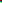

# What does it do?
It creates a ".ppm" File (P6, Binary, up to 255 Colors per Color-Channel), which includes the Header and the Pixels Color Values after. The Image should be instantly openable after it is done.

It also overwrites the specified File, so be careful what you tell it to write to.

# How to use?
It's quite simple to use, all you need to do, is to supply it with a Filename/Filepath, the Width, Height, Color-Depth and an Array with the Color Values, that you intend to output.

## Variable Types:
- The Filepath must be a Char-Array/String
- Width, Height and Color must be a sort of Integer
- The Color Array must be unsigned int8's

## Structure of the Color Array:
The Array must be the Image's Width * Height * 3 big, the 3 is there due to it being R-G-B per Pixel. Any Value in the Array is not allowed to go over the Specified Color-Depth Value.

For a Image of the Size 2 Pixels Wide, 2 Pixels High, you need an Array-Size of 12, an Example, with Color-Depth set to 1:

```C
uint8_t example1 = {0, 0, 0,  1, 0, 0,
                    0, 1, 0,  0, 0, 1};
//Or differently shown:
uint8_t example1 = {0, 0, 0, 1, 0, 0, 0, 1, 0, 0, 0, 1};
```

This should result in a Image with (Top to Bottom, Left to Right) firstly a Black Pixel, a Red Pixel, a Green Pixel, and lastly a Blue Pixel.

An another example is this, which represents a 2 Wide and 3 High Image, with the Color-Depth also set to 1:
```C
uint8_t Example2[18] = {0, 0, 0, 1, 0, 0, 0, 1, 0, 0, 0, 1, 1, 1, 0, 0, 1, 1};
```


## Code Example
Lets take the Second Example, and say we want to Output it, this is how it should be done:
```C
int functionOutput = writeToPPM("out.ppm", 2, 3, 1, Example2);
switch(functionOutput)
{
    case 1:
        printf("[ERROR] File Error\n");
        break;
    
    case 2:
        printf("[ERROR] fwrite() Error\n");
        break;

    default:
        printf("[Info] Writing Successful\n");
        break;
}
```
What the Variables that are being Passed mean, in order:
- Filename/Filepath = "out.ppm"
- Width of Image = 2
- Height of Image = 3
- Color-Depth of Image = 1
- Color Array/Actual Pixel Data

It returns a Value from 0 to 2, here is what they mean:
- 0 = Everything went according to Plan
- 1 = Couldn't open/create the specified File
- 2 = Something went wrong while writing the Image, perhaps ran out of Space?